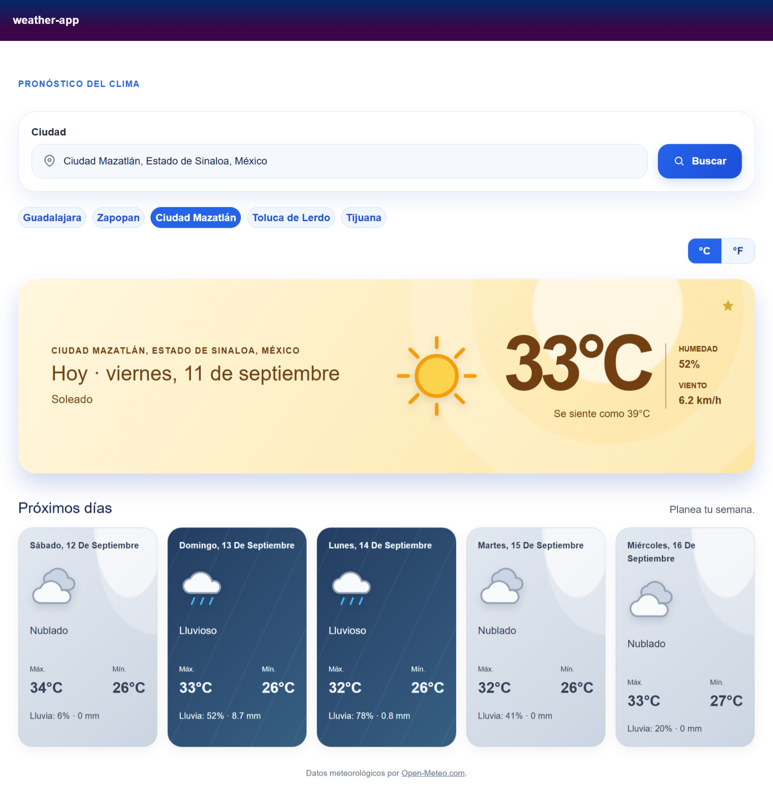

# weather-app

Aplicación web de pronóstico meteorológico construida con ASP.NET Core y Blazor. Permite buscar una ciudad, consultar sus condiciones actuales y el pronóstico de los próximos cinco días, elegir entre grados Celsius y Fahrenheit, y conservar ciudades favoritas en el navegador.

Los datos se obtienen en tiempo real desde [Open-Meteo](https://open-meteo.com/).

## Vista previa



## Funcionalidades

- Búsqueda de ciudades en español con sugerencias después de escribir al menos dos caracteres.
- Selección precisa de una ciudad mediante sus coordenadas, para distinguir ubicaciones con el mismo nombre.
- Condiciones actuales: temperatura, sensación térmica, humedad, viento y estado del tiempo.
- Pronóstico de los cinco días posteriores con temperaturas máxima y mínima, probabilidad de lluvia y precipitación acumulada.
- Cambio inmediato entre °C y °F.
- Hasta cinco ciudades favoritas, guardadas localmente por navegador.
- Estados de carga y errores comprensibles cuando no se encuentra una ciudad o el proveedor no está disponible.
- Navegación accesible de las sugerencias con teclado (`↑`, `↓`, `Enter` y `Esc`).

## Ejemplo de uso

1. Abre la aplicación y escribe `Mazatlán` en el campo **Ciudad**.
2. Selecciona **Ciudad Mazatlán, Estado de Sinaloa, México** entre las sugerencias.
3. Consulta el clima actual y los cinco días siguientes.
4. Usa el control °C/°F para cambiar la unidad o la estrella para agregar la ciudad a favoritos.

> La información del clima cambia con el tiempo. La interfaz se verificó usando Mazatlán, Sinaloa, México el 11 de septiembre de 2026.

## Tecnologías

| Área | Tecnología |
| --- | --- |
| Plataforma | .NET 10 y ASP.NET Core |
| Interfaz | Blazor Web App con componentes interactivos del servidor |
| Arquitectura | Vertical slices y CQRS con mediador propio fuertemente tipado |
| Datos meteorológicos y geocodificación | Open-Meteo |
| Caché | `IMemoryCache` en memoria |
| Favoritos | `localStorage` mediante JavaScript interop |
| Pruebas | MSTest |
| Contenedorización | Docker con imágenes oficiales de .NET 10 |

## Arquitectura

El proyecto organiza el comportamiento por caso de uso. Los componentes Blazor se limitan a la presentación y envían consultas al mediador; los handlers implementan las reglas y delegan la comunicación externa al cliente de Open-Meteo.

```text
Componentes Blazor
        |
        v
IWeatherMediator
        |
        +--> SearchCitiesQueryHandler ------> OpenMeteoClient
        |
        +--> GetWeatherForecastQueryHandler -> caché en memoria -> OpenMeteoClient
                                                              |
                                                              v
                                                        API de Open-Meteo
```

Los principales casos de uso son:

- `Features/WeatherForecast/SearchCities`: obtiene hasta ocho coincidencias para el autocompletado. La interfaz aplica una espera de 300 ms y cancela búsquedas que ya no son vigentes.
- `Features/WeatherForecast/GetForecast`: solicita las condiciones actuales y el pronóstico diario. El resultado se conserva diez minutos en caché, identificado por coordenadas cuando se selecciona una sugerencia.
- `Features/Favorites`: administra favoritos sin servidor ni base de datos. Cada navegador conserva su propia lista y el máximo es de cinco ciudades.

## Requisitos

- [.NET SDK 10](https://dotnet.microsoft.com/download/dotnet/10.0) o posterior compatible.
- Conexión a Internet para consultar las APIs públicas de Open-Meteo.
- Un navegador moderno.

No se requieren claves de API, variables de entorno, una base de datos ni configuración adicional para ejecutar el proyecto localmente.

## Instalación y ejecución

Clona el repositorio y restaura las dependencias:

```bash
git clone https://github.com/TonySauceda/weather-app.git
cd weather-app
dotnet restore
```

Inicia la aplicación con el perfil HTTP:

```bash
dotnet run --launch-profile http
```

Después, abre [http://localhost:5077](http://localhost:5077). También puedes usar el perfil `https`, que expone `https://localhost:7217` y puede requerir confiar el certificado de desarrollo de .NET.

## Despliegue con Docker

El `Dockerfile` crea una imagen de producción en varias etapas: compila con el SDK de .NET 10, publica la aplicación y la ejecuta con el usuario sin privilegios de la imagen oficial. El contenedor escucha en el puerto `8080` y no incluye pruebas ni artefactos locales, que se excluyen mediante `.dockerignore`.

Construye la imagen desde la raíz del repositorio:

```bash
docker build -t weather-app:latest .
```

La aplicación está diseñada para ejecutarse detrás de un proxy inverso que termine TLS. Para iniciarla en segundo plano y limitar el puerto interno al host local:

```bash
docker run -d \
  --name weather-app \
  --restart unless-stopped \
  -p 127.0.0.1:8080:8080 \
  -e ASPNETCORE_ENVIRONMENT=Production \
  weather-app:latest
```

Configura el proxy para enviar las solicitudes a `http://127.0.0.1:8080` y para incluir `X-Forwarded-Proto: https`. El contenedor procesa ese encabezado para conservar el esquema HTTPS original y evitar redirecciones cíclicas.

No expongas directamente el puerto `8080` a Internet: debe estar disponible únicamente para el proxy de confianza. Si el proxy se ejecuta en otro contenedor, conéctalo mediante una red privada de Docker en lugar de publicar el puerto en todas las interfaces.

Para revisar los registros o detener el contenedor:

```bash
docker logs -f weather-app
docker stop weather-app
docker rm weather-app
```

## Pruebas

El proyecto de pruebas cubre los handlers de búsqueda y pronóstico, el cliente de Open-Meteo y el comportamiento de los favoritos. Ejecútalo desde la raíz del repositorio:

```bash
dotnet test weather-app.Tests/weather-app.Tests.csproj
```

## Estructura del proyecto

```text
Application/Mediator/                 Contratos e implementación del mediador
Components/                           Componentes, páginas, estilos y JavaScript de Blazor
Features/
  Favorites/                          Modelo, límite y almacenamiento local de favoritos
  WeatherForecast/
    GetForecast/                      Consulta, handler y cliente de pronóstico
    SearchCities/                     Consulta, handler y modelos de autocompletado
weather-app.Tests/                    Pruebas automatizadas con MSTest
Program.cs                            Composición de dependencias y canalización HTTP
```

## Datos, caché y privacidad

- Las búsquedas de ciudades y de pronóstico se envían a los endpoints públicos de Open-Meteo; consulta sus [términos de uso](https://open-meteo.com/en/terms) antes de desplegar la aplicación.
- El pronóstico se almacena únicamente en memoria del servidor durante diez minutos. Se pierde al reiniciar la aplicación.
- Los favoritos se guardan en el `localStorage` del navegador que los creó. No se sincronizan entre dispositivos, no se envían al servidor y se pueden eliminar desde la propia interfaz.
- La aplicación no implementa cuentas de usuario, autenticación ni almacenamiento persistente en servidor.

## Limitaciones actuales

- No hay demostración pública publicada todavía.
- El funcionamiento depende de la disponibilidad y los datos devueltos por Open-Meteo.
- El mapa de estados meteorológicos agrupa los códigos de Open-Meteo en las categorías `Soleado`, `Parcialmente nublado`, `Nublado` y `Lluvioso`.

## Contribuciones

Las contribuciones son bienvenidas. Para proponer un cambio:

1. Crea una rama descriptiva desde una versión actualizada de `main`.
2. Mantén el cambio acotado y respeta la organización por feature y caso de uso.
3. Agrega o actualiza pruebas cuando cambie el comportamiento.
4. Ejecuta las pruebas y abre un pull request que explique el objetivo y la verificación realizada.

## Licencia

Este proyecto se distribuye bajo la [licencia MIT](LICENSE).

## Autor

Desarrollado por [@TonySauceda](https://github.com/TonySauceda).
